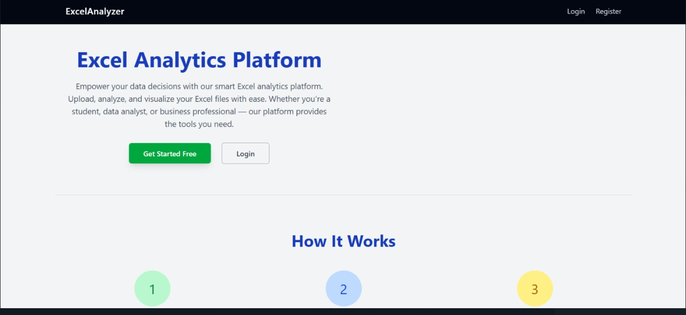
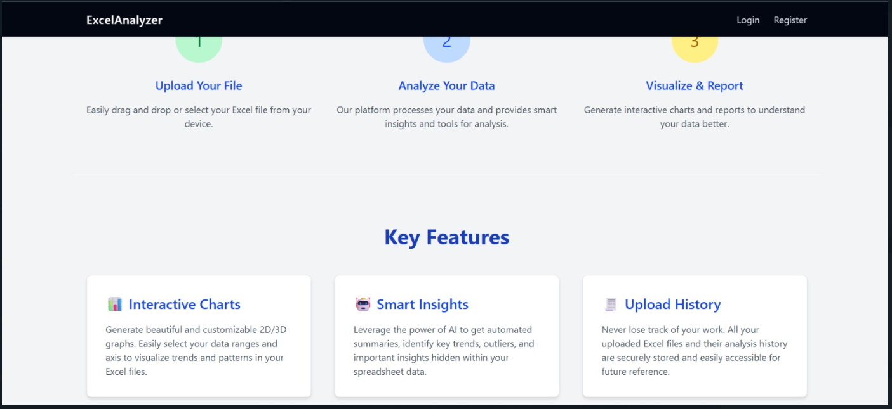
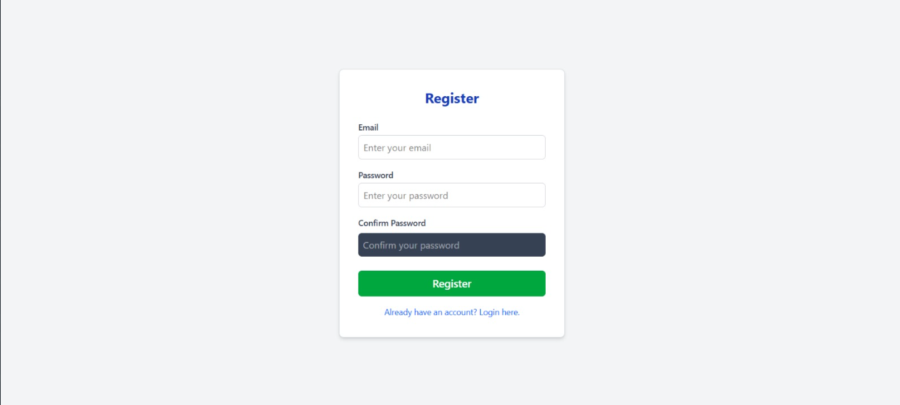
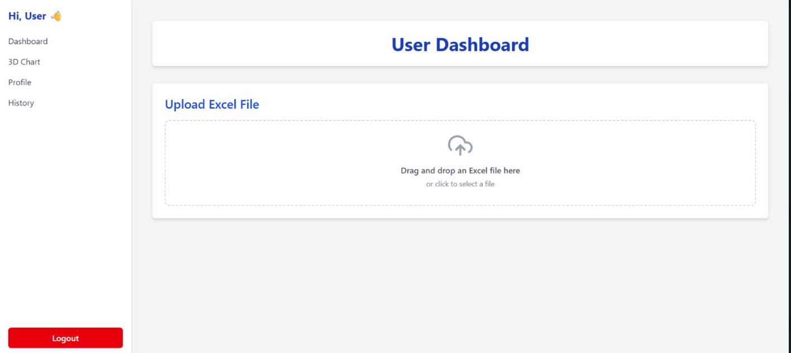
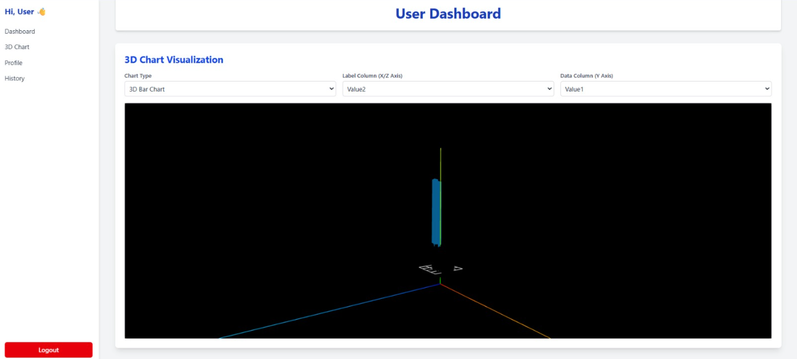
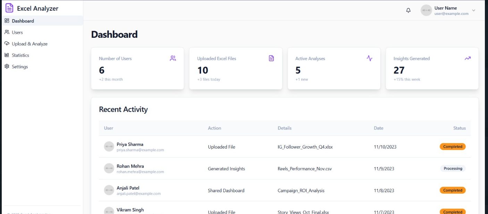
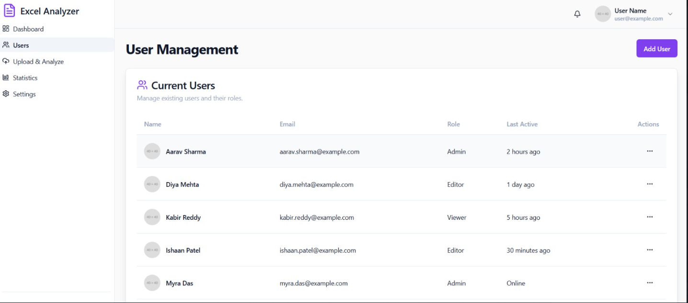

# 📊 Excel Analyzer Platform

An all-in-one Excel analysis platform that allows users to upload `.xlsx` or `.xls` files, analyze data visually with 2D and 3D charts, and view their file history — all in a clean dashboard. Admins can manage users and monitor usage statistics.

## 🚀 Features

- 📂 Upload Excel files and parse data
- 📈 Generate 2D and 3D interactive charts
- 🔍 Dynamic X & Y axis selection
- 🕓 View upload and analysis history
- 👤 User/Admin authentication (JWT-based)
- 🎨 Dark-themed modern UI with Tailwind CSS

---

## 📸 Screenshots

### ✅ Dashboard View  


### 📊 Chart Preview  


---

## 🛠️ Tech Stack

| Frontend  | Backend   | Other       |
|-----------|-----------|-------------|
| React.js  | Node.js   | JWT Auth    |
| Tailwind  | Express   | Multer (File Upload) |
| Recharts  | MongoDB   | dotenv, cors |

---

## 📦 Setup Instructions

### 1. Clone the repository

```bash
git clone https://github.com/Shubhamgiri102/ExcelAnalyzer.git
cd ExcelAnalyzer
cd Backend
npm install
cd ../frontend
npm install
npm run dev
📬 Contact
Shubham Giri
📧 girishubham451@gmail.com
🌐 LinkedIn | GitHub

---

### ✅ STEP 3: Add the README.md to Git

1. Save the above as `README.md` in your root project folder (`excelfirebase/`).
2. Then run:
   ```bash
   git add README.md
   git commit -m "Added detailed README with screenshots"
   git push origin main

## 📸 Project Screenshots

### 🔹 Landing Page


### 🔹 Login Page


### 🔹 Register Page


### 🔹 User Dashboard


### 🔹 Upload Excel


### 🔹 2D Chart View


### 🔹 3D Chart View


### 🔹 Chart Filters


### 🔹 Admin Dashboard


### 🔹 User History



